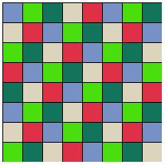

# Drag and Drop

```html
<script src="dragdrop.js" type="text/javascript"></script>
```

## Usage

```html
...
<div id="container1"></div>
<div id="container2"></div>
<div id="container3"></div>
...
<script type="text/javascript">
  var dd = dragdrop.create();
  dd.draw("container1");
  dd.draw("container2");

  dragdrop.create({ numSquares: 5 }).draw("container3");
</script>
```

## Customization

| Option        | Description                                                                                                                                                  | Default                                        |
| ---           | ---                                                                                                                                                          | ---                                            |
| border        | The border to draw around each square.                                                                                                                       | `{ size: 0, format: "solid", color: "black" }` |
| numSquares    | The number of squares to draw in the `<div>`.                                                                                                                | `1`                                            |
| randomColors  | Number of random colors to generate to color the squares. Overrides `squareColors`.                                                                          | `null`                                         |
| showNumbering | Label each square with incrementing number as it is drawn.                                                                                                   | `false`                                        |
| squareColors  | An array of colors used to draw the squares. Square `n` is assigned the color `squareColors[n % squareColors.length]`. Ignored if `randomColors` is present. | `["gray"]`                                     |
| squareSize    | The size of each square in pixels.                                                                                                                           | `100`                                          |

### Example

```html
<!DOCTYPE html>
<html>
  <head>
    <title>Dragdrop JS</title>
    <link rel="stylesheet" type="text/css" href="dragdrop.css" />
    <style type="text/css">
      #box {
        height: 200px;
        width: 200px;
      }
    </style>
  </head>
  <body>
    <div id="box"></div>
    <script src="dragdrop.js" type="text/javascript"></script>
    <script type="text/javascript">
      dragdrop.create({
        numSquares: 64,
        squareSize: 25,
        randomColors: 5,
        border: { size: 1 }
      }).draw("box");
    </script>
  </body>
</html>
```


